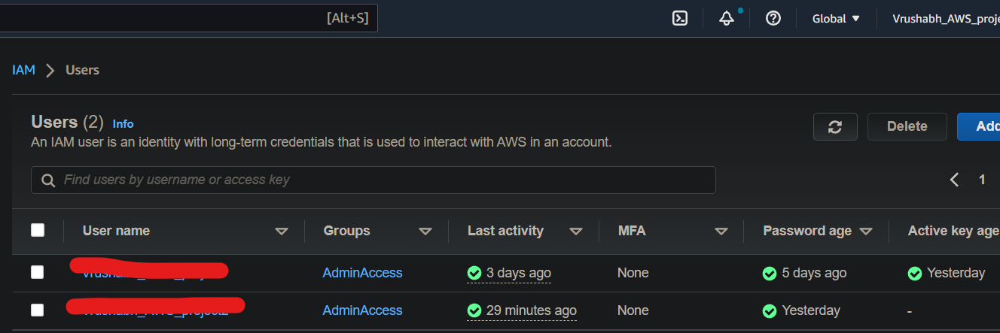
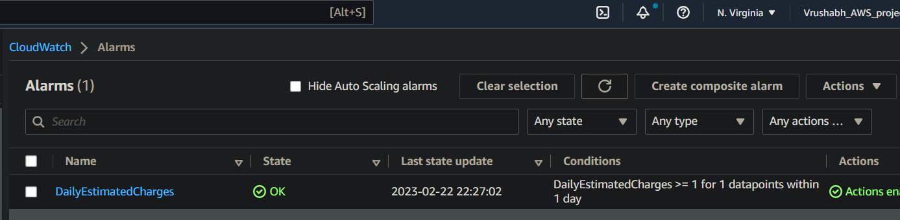
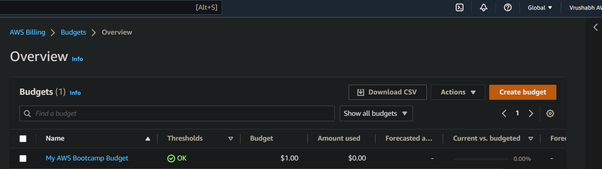
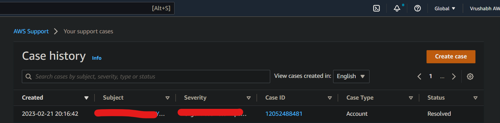
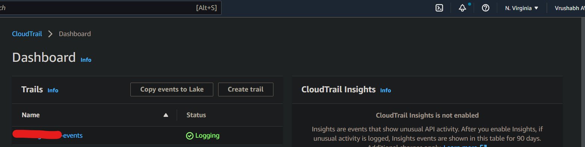

# Week 0 — Billing and Architecture
I am a begineer, so I will just follow along and try new things whenever I get time.

I use dark mode for my browser, so all my AWS screenshots will be in dark mode.
## Required Homework/Tasks
### Installed AWS CLI
I followed along the youtube video, used Gitpod workspace to install the AWS CLI.

I used the following commands:

```
curl "https://awscli.amazonaws.com/awscli-exe-linux-x86_64.zip" -o "awscliv2.zip"
unzip awscliv2.zip
sudo ./aws/install

```
I also setup AWS CLI auto prompt in Gitpod.

Refer this gitpod.yml [FILE](https://github.com/vrushabhjv/aws-bootcamp-cruddur-2023/blob/main/.gitpod.yml) as proof.
### AWS CloudShell
I tried out AWS cloudshell and I did not have any problems working with it.
### Create an ADMIN user
I have actually created two IAM users with Admin previlages.


I have hidden the IAM user names.
### Create a billing alarm
I have created billing alarm using CLI.

This is the [LINK](https://github.com/vrushabhjv/aws-bootcamp-cruddur-2023/blob/main/aws/json/alarm-config.json) to JSON file.

### Create a budget
I have created a single budget using CLI as well.

This is the [LINK](https://github.com/vrushabhjv/aws-bootcamp-cruddur-2023/blob/main/aws/json) to required JSON files.

### Cruddur Conceptual diagram using Lucidchart


The above diagram can be verified through this [LINK](https://lucid.app/lucidchart/30f1105d-e808-4020-9f03-811a48469096/edit?viewport_loc=-329%2C-196%2C1921%2C774%2C0_0&invitationId=inv_23c2020d-c09b-40fa-a7fd-6d6c463e364f) to Lucid Charts.
### Cruddur Logical Diagram using Lucidchart


The above diagram can be verified through this [LINK](https://lucid.app/lucidchart/b0aa8afd-d5da-41da-9ee6-f3f264f56b6b/edit?viewport_loc=-3270%2C-265%2C3867%2C1558%2C0_0&invitationId=inv_962e448d-8338-478e-b46c-de6bd34eb2fd) to Lucid charts.

## Homework challenges
### MFA
I have enabled MFA for both Root user and IAM user

### AWS Support Center
I had accidentally exposed my IAM access keys, so I got the chance to explore the AWS support center as a issue had been raised.
The isssue is currently resolved and it was extremely good response from AWS support.

I am attaching the proof of issue on AWS support center



### AWS CloudTrail
I have created AWS CloudTrail to track API calls.

This is the screenshot of CloudTrail

