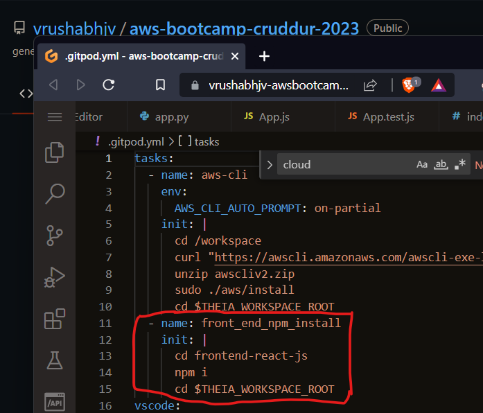

# Week 1 — App Containerization
## Required Homeworks/Tasks
### 1. Containerizing the Backend
To containerize your applications, I first started off by creating `Dockerfile`s for each of the services. In this [link](https://docs.docker.com/develop/develop-images/dockerfile_best-practices/), we can find a detailed explanation and best practices on how to create one. 

For the backend, create a `Dockerfile` in the `backend-flask` directory.
I pasted the following content in `Dockerfile` in the `backend-flask` directory.

I have also made comments as to the functions done by each line of code in the `dockerfile`
```dockerfile
FROM python:3.10-slim-buster
# Inside container
# Make a new folder inside container
WORKDIR /backend-flask

# outside container -> Inside container
# This contains the libraries to install to run the app
COPY requirements.txt requirements.txt

# Inside container
# Install the python libraries used for the app
RUN pip3 install -r requirements.txt

# Outside container to inside container
# . . means everything in the current directory
# first period . means /backend-flask (outside container)
# second period . means /backend-flask (inside container)
COPY . .

# Set environment variables
# Inside container and will remain set when the container is running
ENV FLASK_ENV=development

EXPOSE ${PORT}
CMD [ "python3", "-m" , "flask", "run", "--host=0.0.0.0", "--port=4567"]
```
Refer this [FILE](https://github.com/vrushabhjv/aws-bootcamp-cruddur-2023/blob/main/backend-flask/Dockerfile) for the above code. This is a `dockerfile`.

Now building the container using the image created in `Dockerfile`
```bash
# This is to build our image while in the backend-flask/ directory
# -t is for naming the image 
# Ensure we are in root directory before running the below command
docker build -t  backend-flask ./backend-flask
# The above command gives the tag as latest, we can use the below code to actually tag a container
docker build -t backend-flask:version.1
```
Now if we try to run the container directly, it will not work as we have not set BACKEND_URL and FRONTEND_URL environment variables.
There are multiple ways of setting them. I used the below method.
```bash
docker run --rm -p 4567:4567 -it -e FRONTEND_URL='*' -e BACKEND_URL='*' backend-flask
```
Now if we check in ports, port 4567 can be found. We will get the 404 error if we open it in browser.

We need to append /api/activities/home to specify the endpoint(I believe). Now the 'json' code is returned.


### 2. Containerizing the Frontend
#### Run NPM Install
We have to run NPM Install before building the container since it needs to copy the contents of node_modules.
```
cd frontend-react-js
npm i
```
To avoid doing this everytime, I have added the install npm task to 'gitpod.yml' file.



#### Create Docker File
I copied the following code to `Dockerfile` in `frontend-react-js` directory. I somehow with help from Google and ChatGpt managed to understand what exactly the code does and was able to relate it to the dockerfile created for backend.
```dockerfile
FROM node:16.18

ENV PORT=3000

COPY . /frontend-react-js
WORKDIR /frontend-react-js
RUN npm install
EXPOSE ${PORT}
CMD ["npm", "start"]
```
Refer this [FILE](https://github.com/vrushabhjv/aws-bootcamp-cruddur-2023/blob/main/frontend-react-js/Dockerfile) for the above code. This is a `dockerfile`.

#### Build the image
Build the `Dockerfile` you created into an image 
```bash
# This is to build our image while in the frontend-react-js/ directory
# -t is for naming the image 
docker build -t frontend-react-js
```
#### Run the container
Start up the container using the docker run command 
```bash
docker run --rm -p 3000:3000 -it frontend-react-js
```
### 3. Running Multiple Containers

The above mentioned process was for running the frontend and backend containers separately. Although we can implement the above process and run multiple containers by running the containers in background
```bash
docker container run --rm -p 4567:4567 -d backend-flask
```

#### Create a docker-compose file

The other method is to create a `docker-compose.yml` file in the root directory. This is a simple process because, from the explorer itself we can either compose-up, compose-down or compose-restart. With this we can run frontend and backend together to run the application to test it in real-time.

Create a `docker-compose.yml` file in root directory and paste the following code
```dockerfile
version: "3.8"
services:
  backend-flask:
    environment:
      FRONTEND_URL: "https://3000-${GITPOD_WORKSPACE_ID}.${GITPOD_WORKSPACE_CLUSTER_HOST}"
      BACKEND_URL: "https://4567-${GITPOD_WORKSPACE_ID}.${GITPOD_WORKSPACE_CLUSTER_HOST}"
    build: ./backend-flask
    ports:
      - "4567:4567"
    volumes:
      - ./backend-flask:/backend-flask
  frontend-react-js:
    environment:
      REACT_APP_BACKEND_URL: "https://4567-${GITPOD_WORKSPACE_ID}.${GITPOD_WORKSPACE_CLUSTER_HOST}"
    build: ./frontend-react-js
    ports:
      - "3000:3000"
    volumes:
      - ./frontend-react-js:/frontend-react-js

# the name flag is a hack to change the default prepend folder
# name when outputting the image names
networks: 
  internal-network:
    driver: bridge
    name: cruddur
```
See the above `docker-compose.yml` file in [THIS](https://github.com/vrushabhjv/aws-bootcamp-cruddur-2023/blob/main/docker-compose.yml) link.

Because our volumes are mapped, if we make changes to our frontend, we would immediately see those changes.

The below scheenshot shows multiple containers running and multiple ports available.


### 4. Adding Endpoint for Notifications - Using Flask for Backend 

Add the notifications endpoint to the `openapi-3.0.yml` file using these contents:
```yaml
#create a path using the OpenAPI extension
/api/activities/notifications:
    get:
      description: 'Return a feed of activity for all those I follow'
      tags: 
        - activities
      parameters: []
      responses:
        '200':
          description: Return an array of activities 
          content:
            application/json:
              schema:
                type: array
                items: 
                  $ref: '#/components/schemas/Activity'
```
The `openapi-3.0.yml`file can be seen in this [LINK](https://github.com/vrushabhjv/aws-bootcamp-cruddur-2023/blob/main/backend-flask/openapi-3.0.yml)

Now we need to add a route for the endpoint we created. Add these contents to the `backend-flask/app.py` file 
```python
# It adds the notifications module
from services.notifications_activities import *
# add notifications route 
@app.route("/api/activities/notifications", methods=['GET'])
def data_notifications():
  data = NotificationsActivities.run()
  return data, 200
```
Add the above code in [THIS](https://github.com/vrushabhjv/aws-bootcamp-cruddur-2023/blob/main/backend-flask/app.py) file.

Go ahead and add a `notification_activities.py` file in the `backend-flask/services/` directory

Add the following content to the created file 
```python
from datetime import datetime, timedelta, timezone
class NotificationsActivities:
  def run():
    now = datetime.now(timezone.utc).astimezone()
    results = [{
      'uuid': '68f126b0-1ceb-4a33-88be-d90fa7109eee',
      'handle':  'Dev Queen',
      'message': 'Yah, I got this!',
      'created_at': (now - timedelta(days=2)).isoformat(),
      'expires_at': (now + timedelta(days=5)).isoformat(),
      'likes_count': 5,
      'replies_count': 1,
      'reposts_count': 0,
      'replies': [{
        'uuid': '26e12864-1c26-5c3a-9658-97a10f8fea67',
        'reply_to_activity_uuid': '68f126b0-1ceb-4a33-88be-d90fa7109eee',
        'handle':  'Worf',
        'message': 'This post has no honor!',
        'likes_count': 0,
        'replies_count': 0,
        'reposts_count': 0,
        'created_at': (now - timedelta(days=2)).isoformat()
      }],
    }
    ]
    return results
```
The above code is available in [THIS](https://github.com/vrushabhjv/aws-bootcamp-cruddur-2023/blob/main/backend-flask/services/notifications_activities.py) file.

***Most the above code is copied from /api/activities/home as it is mostly similar to what we need for notifications feature with minor changes***

### 5. Adding the frontend-react-js part for Notifications

We need to add a notification feed to the `app.js` file in the `frontend-react-js/src/app.js` directory.

Write the following code.

```js
//to import the module
import NotificationsFeedPage from './pages/NotificationsFeedPage';
//delete this line from the code (optional as it does not break anything)
import process from 'process';
//under the const router ... add a router for notifications
{
    path: "/notifications",
    element: <NotificationsFeedPage />
  },
```
Added the above code in [THIS](https://github.com/vrushabhjv/aws-bootcamp-cruddur-2023/blob/main/frontend-react-js/src/App.js) file.

Now let's create a page for the feed we just created:
In frontend-react-js/src/pages/ create `NotificationsFeedPage.js` and `NotificationsFeedPage.css`

Add the following content to the `NotificationsFeedPage.js` file:
```js
import './NotificationsFeedPage.css';
import React from "react";
import DesktopNavigation  from '../components/DesktopNavigation';
import DesktopSidebar     from '../components/DesktopSidebar';
import ActivityFeed from '../components/ActivityFeed';
import ActivityForm from '../components/ActivityForm';
import ReplyForm from '../components/ReplyForm';
// [TODO] Authenication
import Cookies from 'js-cookie'
export default function NotificationsFeedPage() {
  const [activities, setActivities] = React.useState([]);
  const [popped, setPopped] = React.useState(false);
  const [poppedReply, setPoppedReply] = React.useState(false);
  const [replyActivity, setReplyActivity] = React.useState({});
  const [user, setUser] = React.useState(null);
  const dataFetchedRef = React.useRef(false);
  const loadData = async () => {
    try {
      const backend_url = `${process.env.REACT_APP_BACKEND_URL}/api/activities/notifications`
      const res = await fetch(backend_url, {
        method: "GET"
      });
      let resJson = await res.json();
      if (res.status === 200) {
        setActivities(resJson)
      } else {
        console.log(res)
      }
    } catch (err) {
      console.log(err);
    }
  };
  const checkAuth = async () => {
    console.log('checkAuth')
    // [TODO] Authenication
    if (Cookies.get('user.logged_in')) {
      setUser({
        display_name: Cookies.get('user.name'),
        handle: Cookies.get('user.username')
      })
    }
  };
  React.useEffect(()=>{
    //prevents double call
    if (dataFetchedRef.current) return;
    dataFetchedRef.current = true;
    loadData();
    checkAuth();
  }, [])
  return (
    <article>
      <DesktopNavigation user={user} active={'notifications'} setPopped={setPopped} />
      <div className='content'>
        <ActivityForm  
          popped={popped}
          setPopped={setPopped} 
          setActivities={setActivities} 
        />
        <ReplyForm 
          activity={replyActivity} 
          popped={poppedReply} 
          setPopped={setPoppedReply} 
          setActivities={setActivities} 
          activities={activities} 
        />
        <ActivityFeed 
          title="Notifications" 
          setReplyActivity={setReplyActivity} 
          setPopped={setPoppedReply} 
          activities={activities} 
        />
      </div>
      <DesktopSidebar user={user} />
    </article>
  );
}
```
The above code is available in [THIS](https://github.com/vrushabhjv/aws-bootcamp-cruddur-2023/blob/main/frontend-react-js/src/pages/NotificationsFeedPage.js) file.

***This completes the frontend and backend for notifications feature***

The below screenshot shows working notifications page.


### 6. Creating and Running DynamoDB Local 

DynamoDB local is a downloadable version of DynamoDB that enables developers to develop and test applications using a version of DynamoDB running in your own development environment. Read [more](https://hub.docker.com/r/amazon/dynamodb-local)

To create our `dynamodb` service, add this content to the `docker-compose.yml` file
```yaml
  dynamodb-local:
    # https://stackoverflow.com/questions/67533058/persist-local-dynamodb-data-in-volumes-lack-permission-unable-to-open-databa
    # We needed to add user:root to get this working.
    user: root
    command: "-jar DynamoDBLocal.jar -sharedDb -dbPath ./data"
    image: "amazon/dynamodb-local:latest"
    container_name: dynamodb-local
    ports:
      - "8000:8000"
    volumes:
      - "./docker/dynamodb:/home/dynamodblocal/data"
    working_dir: /home/dynamodblocal
```
See the above `docker-compose.yml` file in [THIS](https://github.com/vrushabhjv/aws-bootcamp-cruddur-2023/blob/main/docker-compose.yml) link.

Directory volume mapping
```
volumes: 
- "./docker/dynamodb:/home/dynamodblocal/data"
```

### 7. Creating and Running Postgres DB

To create our `postgres` service, add this content to the `docker-compose.yml` file 
```yaml
  db:
    image: postgres:13-alpine
    restart: always
    environment:
      - POSTGRES_USER=postgres
      - POSTGRES_PASSWORD=password
    ports:
      - '5432:5432'
    volumes: 
      - db:/var/lib/postgresql/data
volumes:
  db:
    driver: local
```
See the above `docker-compose.yml` file in [THIS](https://github.com/vrushabhjv/aws-bootcamp-cruddur-2023/blob/main/docker-compose.yml) link.

To be able to intercat with the `postgres client`, we need to install the driver. And to do that, we need to add these following lines to our `gitpod.yml` file:
```yaml
- name: postgres
    init: |
      curl -fsSL https://www.postgresql.org/media/keys/ACCC4CF8.asc|sudo gpg --dearmor -o /etc/apt/trusted.gpg.d/postgresql.gpg
      echo "deb http://apt.postgresql.org/pub/repos/apt/ `lsb_release -cs`-pgdg main" |sudo tee  /etc/apt/sources.list.d/pgdg.list
      sudo apt update
      sudo apt install -y postgresql-client-13 libpq-dev
```
See the above `gitpod.yml` file in [THIS](https://github.com/vrushabhjv/aws-bootcamp-cruddur-2023/blob/main/.gitpod.yml) link.

Now to get the `postgres` installed, you could either manually run the commands above individually. Or stop `gitpod` and restart it. Either way works. 

After installation, we can create a database with any password of choice using the postgres extension in `gitpod`. I did not try this part.

After creating a database we can connect to the `postgres client` using these commands:
```bash
# to connect to the postgres client
psql --host localhost
# to access the postgres DB
psql -h localhost -U postgres
# play around with the postgres commands 
\l # lists the tables you have 
\dl
\q # quits the DB
```
