# Week 2 — Distributed Tracing
## Required Homeworks/Tasks
### Honeycomb
#### 1. Setting up Honeycomb

Let's set up our environment in honeycomb

First, I created an honeycomb account on this [LINK](ui.honeycomb.io). Then under environment, I created a new environment by name Bootcamp. Copied those API keys to set up environment variables in `Gitpod` workspace.


- Open Gitpod workspace and enter the below command

```
export HONEYCOMB_API_KEY=""
export HONEYCOMB_SERVICE_NAME="Cruddur"
gp env HONEYCOMB_API_KEY=""
gp env HONEYCOMB_SERVICE_NAME="Cruddur"
```
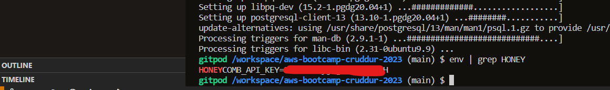

- Add these env vars into `docker-compose.yml` file

```
OTEL_EXPORTER_OTLP_ENDPOINT: "https://api.honeycomb.io"
OTEL_EXPORTER_OTLP_HEADERS: "x-honeycomb-team=${HONEYCOMB_API_KEY}"
OTEL_SERVICE_NAME: "${HONEYCOMB_SERVICE_NAME}"
```
#### 2. Instrument backend flask to use OpenTelemetry (OTEL) with Honeycomb.io as the provider 

Honeycomb is a software debugging tool that can help you solve problems faster within your distributed services. It uses `OTEL` libraries which is simply the `OpenTelemetry` libraries.

Add this command in to requiremnt.txt file
```
    opentelemetry-sdk \
    opentelemetry-exporter-otlp-proto-http \
    opentelemetry-instrumentation-flask \
    opentelemetry-instrumentation-requests
```

In the `backend-flask` directory, run the following command:
```bash
pip install -r requirements.txt
```
Let's create and initialize honeycomb by adding the following lines of code to `app.py` file
```python
# Honeycomb
from opentelemetry import trace
from opentelemetry.instrumentation.flask import FlaskInstrumentor
from opentelemetry.instrumentation.requests import RequestsInstrumentor
from opentelemetry.exporter.otlp.proto.http.trace_exporter import OTLPSpanExporter
from opentelemetry.sdk.trace import TracerProvider
from opentelemetry.sdk.trace.export import BatchSpanProcessor
# Initialize tracing and an exporter that can send data to Honeycomb
provider = TracerProvider()
processor = BatchSpanProcessor(OTLPSpanExporter())
provider.add_span_processor(processor)
trace.set_tracer_provider(provider)
tracer = trace.get_tracer(__name__)
# Initialize automatic instrumentation with Flask
app = Flask(__name__) # if this link already exists, DON'T call it again
FlaskInstrumentor().instrument_app(app)
RequestsInstrumentor().instrument()
```

After the updates, test out your configuration by running this command:
` docker compose up` 


Confirm that honeycomb is getting your data.
#### 3. Working with traces/spans/attribute in Honeycomb.io

**Configure a Tracer**

Add the following lines of code to your `backend-flask/services/home_activities.py` file:
```python
from opentelemetry import trace
# add before the HomeActivities class
tracer = trace.get_tracer("home.activities") # the tracer name here is home_activities
```

**Create a Span**

Create a span with our configured **tracer**. A span simply describes what is happening in your application.

Add the following lines of code to your `backend-flask/services/home_activities.py` file:
```python
# add under def run():
with tracer.start_as_current_span("home-activities-mock-data"):
# make sure every other line beneath is properly indented under the code you pasted 
```

After the updates, test out your configuration by running this command:
` docker compose up` 

To create some spans, append this URL to your backend, `.../api/activities/home`

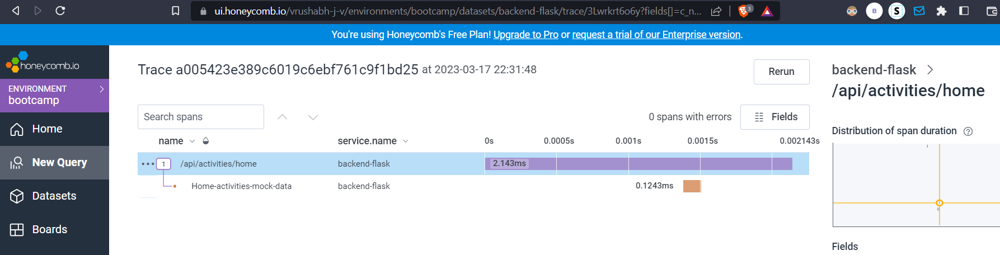

**Add Attribute to Span**

These attributes gives us more context to our logs. Go ahead and add a few by including these lines of code to your `backend-flask/services/home_activities.py` file:
```python
# in the def run(): section
# add attribute -> app.now 
span = trace.get_current_span()
span.set_attribute("app.now", now.isoformat())
# at the bottom -> app.result_length
span.set_attribute("app.result_length", len(results))
```

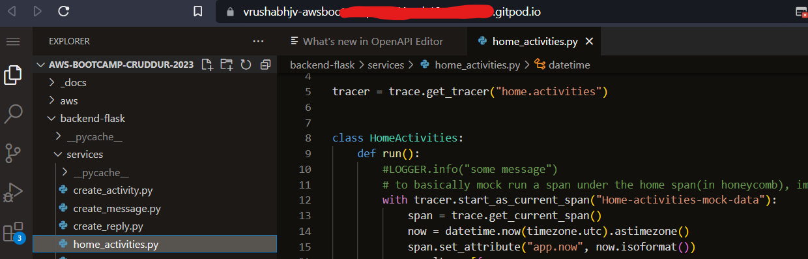

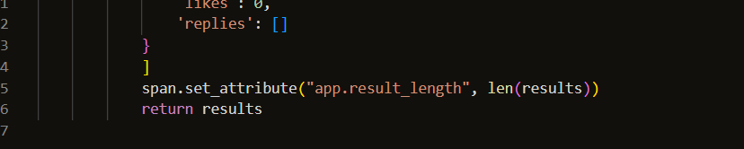

After the updates, test out your configuration by running this command:
` docker compose up` 

#### 4. Run queries to explore traces within Honeycomb.io

With our previously hard-coded attributes `app.now` and `app.result_length`, let's create and run some queries

*Query 1*

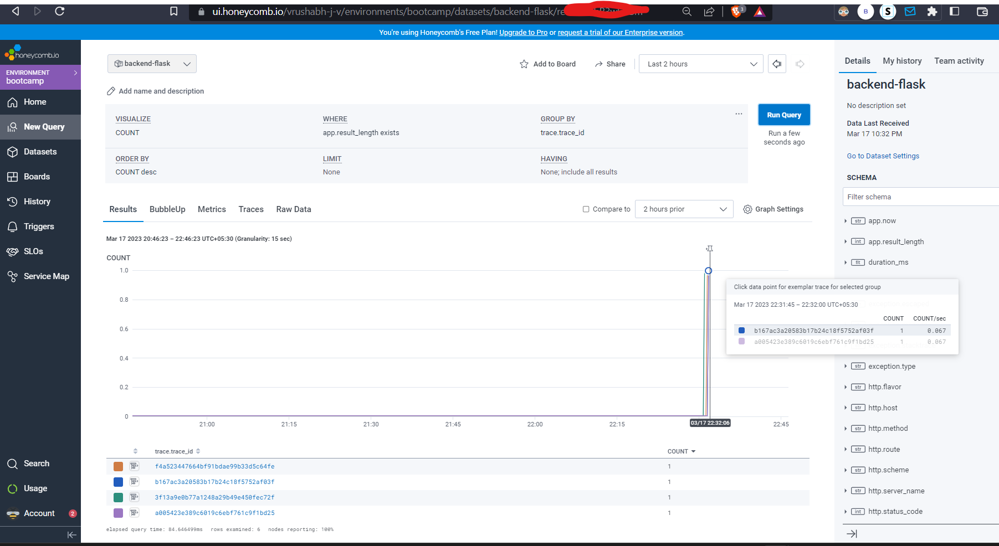

*Query 2*


*Query 3*

Latency - checks how long these requests take
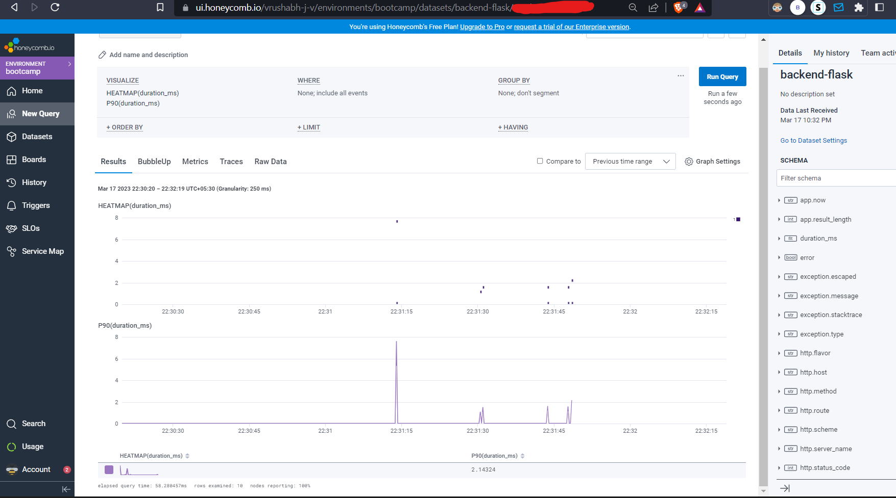

### AWS X-Ray
AWS X-Ray provides a complete view of requests as they travel through your application and filters visual data across payloads, functions, traces, services, APIs, and more with no-code and low-code motions. Read more [here](https://aws.amazon.com/xray/)

#### 1.Install AWS X-ray

First, we need to install the [AWS SDK](https://github.com/aws/aws-xray-sdk-python) 

Add the following lines to the `requirements.txt` file located in the `backend-flask/` directory
```
aws-xray-sdk
```

Go ahead and install the dependencies you listed in the `requirements.txt` file
In the `backend-flask` directory, run the following command:
```
pip install -r requirements.txt
```

**Instrument X-ray for Flask**

To instrument our backend, add the following lines of code to the `backend-flask/app.py`
```python
from aws_xray_sdk.core import xray_recorder
from aws_xray_sdk.ext.flask.middleware import XRayMiddleware
xray_url = os.getenv("AWS_XRAY_URL")
xray_recorder.configure(service='backend-flask', dynamic_naming=xray_url)
XRayMiddleware(app, xray_recorder)
```

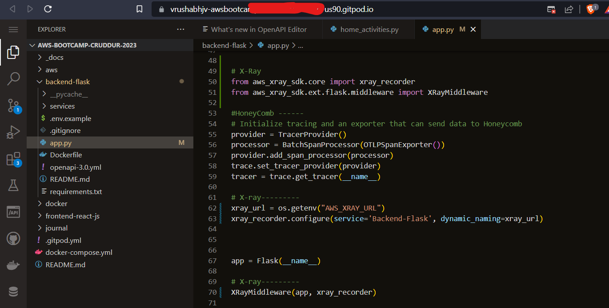

#### 2.Create sampling rule

Create a `xray.json` file in the `aws/json` directory 

Add the following lines of code to your newly created file:
```json
{
  "SamplingRule": {
      "RuleName": "Cruddur",
      "ResourceARN": "*",
      "Priority": 9000,
      "FixedRate": 0.1,
      "ReservoirSize": 5,
      "ServiceName": "backend-flask",
      "ServiceType": "*",
      "Host": "*",
      "HTTPMethod": "*",
      "URLPath": "*",
      "Version": 1
  }
}
```

Let's create an x-ray trace group and a sampling rule. Go ahead and run the following command:
```bash
# create a trace group in AWS x-ray
aws xray create-group \
   --group-name "Cruddur" \
   --filter-expression "service(\"backend-flask\")"
   
# create a sampling rule
aws xray create-sampling-rule --cli-input-json file://aws/json/xray.json
```

#### 3.Configure X-ray daemon with docker-compose

Setup the daemon in the `docker-compose.yml` file by adding these following lines:
```YAML
# add these env variables above in the ENV section
AWS_XRAY_URL: "*4567-${GITPOD_WORKSPACE_ID}.${GITPOD_WORKSPACE_CLUSTER_HOST}*"
AWS_XRAY_DAEMON_ADDRESS: "xray-daemon:2000"
xray-daemon:
    image: "amazon/aws-xray-daemon"
    environment:
      AWS_ACCESS_KEY_ID: "${AWS_ACCESS_KEY_ID}"
      AWS_SECRET_ACCESS_KEY: "${AWS_SECRET_ACCESS_KEY}"
      AWS_REGION: "us-east-1"
    command:
      - "xray -o -b xray-daemon:2000"
    ports:
      - 2000:2000/udp
```

After the updates, test out your configuration by running this command:
` docker compose up` 

Check your x-ray container logs to make sure logs were successfully sent to AWS X-ray.


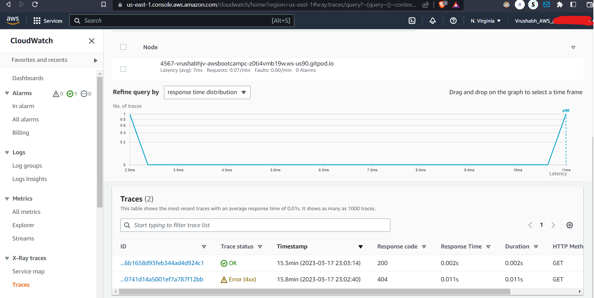

### CloudWatch Logs

Add the following lines to the `requirements.txt` file located in the `backend-flask/` directory
```
watchtower
```

Go ahead and install the dependencies you listed in the `requirements.txt` file
In the `backend-flask` directory, run the following command:
```
pip install -r requirements.txt
```

**Set environment variables for watchtower**

In the `docker-compose.yml` file, add the following lines:
```YAML
AWS_DEFAULT_REGION: "${AWS_DEFAULT_REGION}"
AWS_ACCESS_KEY_ID: "${AWS_ACCESS_KEY_ID}"
AWS_SECRET_ACCESS_KEY: "${AWS_SECRET_ACCESS_KEY}"
```

Now let's configure our CloudWatch logger. Add the following lines to the `app.py` file:
```python
# CloudWatch Logs
import watchtower
import logging
from time import strftime
# Configuring Logger to Use CloudWatch
LOGGER = logging.getLogger(__name__)
LOGGER.setLevel(logging.DEBUG)
console_handler = logging.StreamHandler()
cw_handler = watchtower.CloudWatchLogHandler(log_group='cruddur')
LOGGER.addHandler(console_handler)
LOGGER.addHandler(cw_handler)
LOGGER.info("test message")
```

Down to the section where you see `@app.route...` paste this content before it:
```python
@app.after_request
def after_request(response):
    timestamp = strftime('[%Y-%b-%d %H:%M]')
    LOGGER.error('%s %s %s %s %s %s', timestamp, request.remote_addr, request.method, request.scheme, request.full_path, response.status)
    return response
```

Now let's log something in one of the API endpoint by adding the following lines to our 
`backend-flask/services/home_activities.py` file:
```python
# in the class HomeActivities: section, update and add these lines
def run(logger):
    logger.info("HomeActivities")
```

In the `app.py` file, update this section of your code to look like this:
```python
@app.route("/api/activities/home", methods=['GET'])
def data_home():
  data = HomeActivities.run(logger=LOGGER)
  return data, 200
```

After the updates, test out your configuration by running this command:
` docker compose up` 

### Rollbar

#### 1.Instrument Rollbar

Rollbar is a cloud-based bug tracking and monitoring solution that caters to organizations of all sizes.

Add the following lines to the `requirements.txt` file located in the `backend-flask/` directory
```
blinker 
rollbar
```

Go ahead and install the dependencies listed in the `requirements.txt` file
In the `backend-flask` directory, run the following command:
```
pip install -r requirements.txt
```

Let's add the rollbar access token
```bash
export ROLLBAR_ACCESS_TOKEN=""
gp env ROLLBAR_ACCESS_TOKEN=""
```

Follow the instructions below to retrieve your access token from rollbar :
- Under **Projects**, create a **New Project**
- Click **Next**
- Now, select an SDK - we will be using **Flask**
- Select **Continue**, and you should see an integration page with instructions and your access token

**Add ACCESS_TOKEN to `docker-compose.yml` file**

```YAML
# under environment variables
ROLLBAR_ACCESS_TOKEN: "${ROLLBAR_ACCESS_TOKEN}"
```

**Import Rollbar Libraries**

Let's import the rollbar libraries 
Add the following lines in the `app.py` file 

```python
# Rollbar
import rollbar
import rollbar.contrib.flask
from flask import got_request_exception
# after app = Flask(__name__), to avoid errors
# add these lines 
rollbar_access_token = os.getenv('ROLLBAR_ACCESS_TOKEN')
@app.before_first_request
def init_rollbar():
    """init rollbar module"""
    rollbar.init(
        # access token
        rollbar_access_token,
        # environment name
        'production',
        # server root directory, makes tracebacks prettier
        root=os.path.dirname(os.path.realpath(__file__)),
        # flask already sets up logging
        allow_logging_basic_config=False)
    # send exceptions from `app` to rollbar, using flask's signal system.
    got_request_exception.connect(rollbar.contrib.flask.report_exception, app)
```

**Add Rollbar Endpoint**

Below the code, check for the `@app.route...` to add a rollbar endpoint 
```python
@app.route('/rollbar/test')
def rollbar_test():
    rollbar.report_message('Hello World!', 'warning')
    return "Hello World!"
```

After the updates, test out your configuration by running this command:
` docker compose up` 

Test out the new endpoint you added by appending `/rollbar/test` to your backend URL
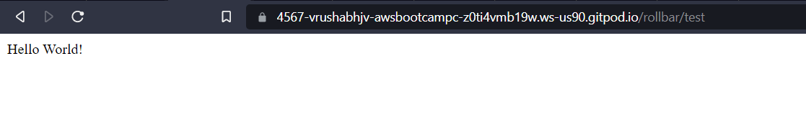

#### 2.Trigger an error and observe it with Rollbar

Let's create an error log for Rollbar.

Navigate to this URL `.../api/activities/home` to view the error page 

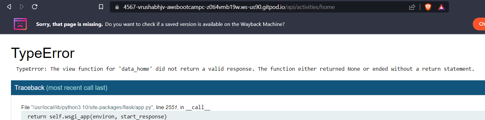

Now we should see the error message logged in your rollbar account, under "Items"

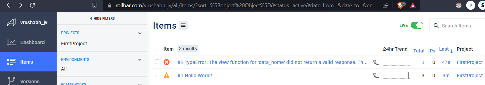

## Extras

Make our application ports automatically public when started up.
Add the following lines of code to your `gitpod.yml` file:
```YAML
# automatically make ports public 
ports:
  - name: frontend
    port: 3000
    onOpen: open-browser
    visibility: public
  - name: backend
    port: 4567
    visibility: public
  - name: x-ray
    port: 2000
    visibility: public
```


